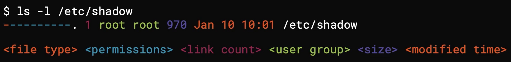

## order of courses on pluralsight

* RHEL 8: Using Essential Tools
* RHEL 8: Configuring Local Storage
* RHEL 8: Creating and Configuring File Systems
* RHEL 8: Operating Running Systems
* RHEL 8: Creating Shell Scripts
* RHEL 8: Deploying, Configuring and Maintaining Systems
* RHEL 8: Managing Users and Groups
* RHEL 8: Managing Networking
* RHEL 8: Managing Security
* What's New In RHEL 9
* Getting Started with Podman


# RHEL 8: Using Essential Tools

# introducing red hat and enterprise linux

## red hat linux family
* RHEL 8: free but requires support subscription for updates (via developers.redhat.com)
* centos 8: red hat rebuild with community support and updates, project ended December 2021.
* centos stream: tracking ahead of RHEL centos stream becomes a dev platform for RHEL

## installing RHEL 8

* this module is a summary of installing rhel8 via virtualbox.
* since I already went through this on the RHCE training course before starting this course, I'll be using vagrant, which is covered in a later module.  You can skip ahead then come back.
* I'll document the modules in order, so I'll now proceed to "Understanding Linux Commands."


## Understanding Linux Commands
* Please subscribe to RobertElderSoftware on youtube and watch his shorts. https://www.youtube.com/shorts/SHI0TL415R8
* also check out explainshell.com

1. access the VM via ssh
```
vagrant ssh rhel8
```

2. you can run commands, they are case sensitive.
```
ls
```

3. you can run commands with arguments
```
ls -a
```

4. you can run commands with specific arguments
```
ls -l /etc/
```

5. invoking with `--help` is generally accepted as the argument to return help info on a command.  `man` will call documentation as well
```
ip addr help
man ip
man man #this will return help on the `man` command
ls /usr/share/doc #additional info
```

## execute commands in linux (lab)

* keep in mind that I installed with vagrant in the next exercise before completing this exercise.

1. login
```
vagrant ssh rhel8
```

2. gather info on the host
```
hostnamectl
```

3. clear the screen with a hotkey
```
hit ctrl+L
```

4. obtain the ip address
```
ip -4 addr show
```

5. show socket status
```
ss -ntl #show listening tcp ports and validate that port 22 is listening
```

## using vagrant (to manage) virtual machines

* using virtualbox with vagrant allows a far simpler approach to VM management and can allow someone else to install RHEL.

### summary
* on host OS
* create the required directories in the host file system
* create/download the Vagrantfile

1. sign up for redhat developer subscription
* https://developers.redhat.com/

2. install vagrant
* https://developer.hashicorp.com/vagrant/downloads and install

3. install virtualbox
* https://www.virtualbox.org/wiki/Downloads

4. create directories (in pwsh)
```
mkdir -f ~/vagrant/rhce
cd ~/vagrant/rhce
```

5. download rhel8 and start a VM
```
vagrant init generic/rhel8
vagrant up
```

6. connect via vagrant ssh
```
vagrant status
vagrant ssh
```

7. register with redhat
```
# there is no longer a need to use auto-attach as simple content access is enabled by default on new dev subscriptions
sudo subscription-manager register --username mbrowndc #this takes a lot longer than you think it should (~90 seconds)
# validate registration
sudo subscription-manager status
+-------------------------------------------+
   System Status Details
+-------------------------------------------+
Overall Status: Disabled
Content Access Mode is set to Simple Content Access. This host has access to content, regardless of subscription status.

System Purpose Status: Disabled
```

# working with text files

## understanding shell redirection and redirection from the CLI (lab)

1. create a file
```
touch file1
```

2. get info on file
```
file file1
```

3. add text with redirection
```
echo hello > file1
```

4. get info on file
```
file file1
```

### understand named pipes

* there are more named pipes than stdout and stderr

1. stdout (redirect standard output with `>`)
```
ls -l /etc/hosts #by default stdout is directed to the console
```

2. stderr (redirect standard error with `2>`)
```
ls -l /etc/foo #by default stderr is also directed to the console
```

### redirect output

1. stdout
```
ls -l /etc/hosts > stdoutput #outputs stdout to the file `stdoutput`
ls -l /etc/hosts >> stdoutput #outputs stdout to the file `stdoutput`, appending the output of this command to the file
```

2. stderr
```
ls -l /etc/Hosts 2> stderror #outputs stderr to the file `stderror`
ls -l /etc/Hosts 2>> stderror #also works
```

3. stdout + stderr
```
ls -l /etc/hosts /etc/Hosts 2>&1 &> stdoutputerror #this directs... stderr to stdout, then directs all output to the file `stdoutputerror`.  yea, you could just use `&>``
```

### redirect input
* in a herestring
```
cat > story.txt << END
line 1
line 2
END
```

## using `tee` for redirection

* `tee` is used to duplicate redirection of output

1. fails since shell redirection will redirect output of `sudo` command, not the output of `echo`
```
sudo echo "1.0.0.1 cloudflare" >> /etc/hosts
```

2. succeeds since the `|` passes stdin to the `sudo` command, which will pass to the invoked command `tee`
```
echo "1.0.0.1 cloudflare" | sudo tee -a /etc/hosts
```

## understanding text editors / editing files using nano / using the vim text editor

* disclaimer: `nano` upsets me (not as much as emacs), so I'm not installing it.

* common linux text editors
  * nano: simple to use and little experience is needed
  * vim: powerful text editor but more time is needed in learning the editor (see https://mbrownnyc.wordpress.com/misc/qvm/ for a quick cheat sheet, and https://tryhackme.com/room/toolboxvim )

* basic software package management introduction
1. list software repositories
```
sudo yum repolist
```

2. no nano! >:|
```
sudo yum install -y vim bash-completion
```

3. note that if you need to access a file with restricted permissions, you must invoke the editor command via `sudo`
```
sudo vim /etc/hosts
```

## working with directories

* `pwd`: print working directory
* `cd`: change working directory, if invoked without args, it will return to your homedir (as if you invoked `cd ~`)
  * `cd -`: change to previous directory

1. create a directory
```
cd
mkdir my_directory
mkdir ~/my_directory
```

2. create all directories in a structure
```
cd
mkdir -p dir1/dir2
```

3. remove directory with files/dirs
* remove an empty directory: `rmdir`.  this will fail if there are files within that directory.
```
rm -rf dir1
```

## file operations (copy, move, delete)

### globbing

* wildcards, like * (any amount of any char) and ? (single char)

### "ranges"
* commands accept `{N..Nx}`

1. create 12 files 
```
touch foo{1..12}
```
  
1. copy a file
```
cd
cp /etc/hosts .
cat ~/hosts
```

2. moving a file
```
mv /etc/hosts . #fails because you can't delete the file at source
```

3. delete a file
```
cd
mkdir test
cd test
rm files??
fm -i files?
```

## reading text files

* `cat`: read entire contents
* `head`: reads number of specified lines from beginning of file
* `tail`: reads number of specified lines from end of file
* `less`: page through files
* `grep`: search file contents

1. read
```
cat /etc/hosts
head -n2 /etc/passwd #first two lines
tail -n2 /etc/passwd #last two lines
wc -l /etc/services #count lines
```

2. grep
* regex101.com is a great site for regex testing
```
sudo grep Password /etc/ssh/sshd_config #lots of lines
sudo grep ^Password /etc/ssh/sshd_config #only matches regex ^ start of line, followed by string
```

# securing files in the filesystem

* File permissions
  * ACLs are supported by default on XFS, which comes default in RHEL8.
  * ACLs are only supported in ext3 if the fs is mounted with the `acl` option.


## understanding file metadata

1. list file permissions
```
ls -l /etc/hosts
ls -l /etc/shadow
```

2. review output of `ls -l`


* file types
  * regular file (`-`)
  * directory (`d`)
  * link (`l`)
  * pipe (`p`)
  * block/character (`b` or `c`)
  * socket (fifo, etc) (`s`)

3. additional metadata
```
[vagrant@rhel8 ~]$ stat /etc/hosts
  File: /etc/hosts
  Size: 207             Blocks: 8          IO Block: 4096   regular file
Device: fd00h/64768d    Inode: 67118389    Links: 1
Access: (0644/-rw-r--r--)  Uid: (    0/    root)   Gid: (    0/    root)
Context: system_u:object_r:net_conf_t:s0
Access: 2024-01-11 10:39:35.946727108 +0000
Modify: 2024-01-11 10:39:28.404596100 +0000
Change: 2024-01-11 10:39:28.404596100 +0000
 Birth: 2023-03-30 00:06:00.025483784 +0000
[vagrant@rhel8 ~]$ stat -c %a /etc/hosts
644
[vagrant@rhel8 ~]$ stat -c %A /etc/hosts
-rw-r--r--
[vagrant@rhel8 ~]$ stat -c %Afoo%a /etc/hosts
-rw-r--r--foo644
```

4. interpolation of command output
* the output of an command invocation can be interpolated into another command invocation via two methods in bash:
  * `$(command)`
  * `` `command` `` (backticks)
```
[vagrant@rhel8 ~]$ tty
/dev/pts/0

[vagrant@rhel8 ~]$ stat
stat: missing operand
Try 'stat --help' for more information.

[vagrant@rhel8 ~]$ stat $(tty)
  File: /dev/pts/0
  Size: 0               Blocks: 0          IO Block: 1024   character special file
Device: 16h/22d Inode: 3           Links: 1     Device type: 88,0
Access: (0620/crw--w----)  Uid: ( 1000/ vagrant)   Gid: (    5/     tty)
Context: unconfined_u:object_r:user_devpts_t:s0
Access: 2024-01-11 11:49:44.091155074 +0000
Modify: 2024-01-11 11:49:44.091155074 +0000
Change: 2024-01-11 10:01:05.092155575 +0000
 Birth: -

[vagrant@rhel8 ~]$ stat `tty`
  File: /dev/pts/0
  Size: 0               Blocks: 0          IO Block: 1024   character special file
Device: 16h/22d Inode: 3           Links: 1     Device type: 88,0
Access: (0620/crw--w----)  Uid: ( 1000/ vagrant)   Gid: (    5/     tty)
Context: unconfined_u:object_r:user_devpts_t:s0
Access: 2024-01-11 11:50:48.091155074 +0000
Modify: 2024-01-11 11:50:48.091155074 +0000
Change: 2024-01-11 10:01:05.092155575 +0000
 Birth: -
```

## default permissions and the umask
* POSIX permissions

* file permissions are bitwise
  * read = 4 in decimal or 100 in binary
  * write = 2 in decimal or 010 in binary
  * execute =1 in decimal or 001 in binary (needed to `cd` to dir)
* Default permissions are:
  * file = 666
  * directory = 777

1. umask value is the default permissions
```
[vagrant@rhel8 ~]$ umask
0002
```

2. change umask

* why use this?
  * the `umask` command only affects the environment (the shell) for which you are working.

```
[vagrant@rhel8 ~]$ umask
0002
[vagrant@rhel8 ~]$ touch test1
[vagrant@rhel8 ~]$ mkdir dirtest1

[vagrant@rhel8 ~]$ umask 0
[vagrant@rhel8 ~]$ umask
0000
[vagrant@rhel8 ~]$ touch test2
[vagrant@rhel8 ~]$ mkdir dirtest2

[vagrant@rhel8 ~]$ ls -ald test? dirtest?
drwxrwxr-x. 2 vagrant vagrant 6 Jan 11 11:56 dirtest1
drwxrwxrwx. 2 vagrant vagrant 6 Jan 11 11:57 dirtest2
-rw-rw-r--. 1 vagrant vagrant 0 Jan 11 11:55 test1
-rw-rw-rw-. 1 vagrant vagrant 0 Jan 11 11:54 test2
```

## changing file permissions

* user: permissions granted to the user owner of the file.  If permission is granted, no other permissions apply.
* group: if the current user does not match the user owner, group membership is checked.
* other: if the current user and groups don't match, then other permission is applied.

1. create a new file
```
touch file_perms
ls -l file_perms
chmod -v 666 file_perms # actively sets all bits in permissions control entry
chmod -v +w file_perms # actively sets the owner bit to write only if it is allowed by the current `umask` in the permissions control entry
chmod -v o+w file_perms # actively sets the owner bit to write in the permissions control entry
```

